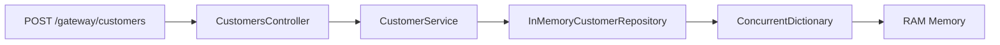

# Banking Microservices MVP

A .NET microservices banking demo with in-memory storage, custom service discovery, centralized configuration, a YARP API gateway, Polly resilience, and Serilog logging.

**Built with SOLID principles using Controller-Service-Repository pattern for maintainable, testable, and extensible code.**

## Documentation

| Guide | Link |
|-------|------|
| **Run & test** (WSL, Windows, Postman) | [docs/steps_run.md](docs/steps_run.md) |
| **Docker** (Compose, one command) | [docs/docker.md](docs/docker.md) |
| **API reference** (all endpoints) | [docs/api.md](docs/api.md) |
| **Docs index** | [docs/README.md](docs/README.md) |

## Quick start

**Prerequisites:** [.NET SDK](https://dotnet.microsoft.com/download) 8.0+ or 10.0+ · optional [Docker](https://www.docker.com/products/docker-desktop/)

```bash
cd BankingMicroservices
dotnet build BankingMicroservices.sln
```

### **Option 1: Start Services in Order (Recommended)**

Open **5 terminals** and start services **in this order**:

```bash
# Terminal 1: Service Discovery (MUST BE FIRST)
dotnet run -f net10.0 --project src/ServiceDiscovery/ServiceDiscovery.csproj      # :5003

# Terminal 2: Configuration Service  
dotnet run -f net10.0 --project src/ConfigurationService/ConfigurationService.csproj  # :5004

# Terminal 3: Customer Management
dotnet run -f net10.0 --project src/CustomerManagementService/CustomerManagementService.csproj  # :5001

# Terminal 4: Account Management  
dotnet run -f net10.0 --project src/AccountManagementService/AccountManagementService.csproj      # :5002

# Terminal 5: API Gateway (LAST)
dotnet run -f net10.0 --project src/ApiGateway/ApiGateway.csproj                  # :5000
```

### **Option 2: Start in Any Order (Resilient Mode)**

Services now include retry logic - you can start in any order:
- Services will retry registration with Service Discovery every 5 seconds
- Background failures won't crash the service
- Once Service Discovery is available, all services will connect automatically

**Why order matters:** Service Discovery (:5003) is the foundation - other services register with it to find each other.

**Or Docker** (see [docs/docker.md](docs/docker.md)):

```bash
docker compose up --build
```

### **Test the Application**

**Smoke test** via API Gateway:

```bash
# List customers (should return empty array initially)
curl -s http://localhost:5000/gateway/customers

# Create a customer
curl -s -X POST http://localhost:5000/gateway/customers \
  -H "Content-Type: application/json" \
  -d '{"name":"Jane Doe","email":"jane@bank.com","phone":"555-0100","address":"123 Main St"}'

# Create account for customer (use customer ID from above response)
curl -s -X POST http://localhost:5000/gateway/accounts \
  -H "Content-Type: application/json" \
  -d '{"customerId":"<customer-id-from-above>"}'
```

## Swagger API Documentation

### **Interactive API Documentation URLs**

Once services are running, access Swagger UI for interactive testing:

| Service | URL | Features |
|---------|-----|----------|
| **Customer Management** | http://localhost:5001/swagger | Create, read, update, delete customers |
| **Account Management** | http://localhost:5002/swagger | Create accounts, deposits, withdrawals, balance checks |
| **Service Discovery** | http://localhost:5003/swagger | Service registration, service lookup |
| **Configuration Service** | http://localhost:5004/swagger | Get configuration for each service |

### **Using Swagger for Testing**

1. **Start services** (locally or via Docker)
2. **Open Swagger UI** in your browser using URLs above
3. **Click "Try it out"** on any endpoint
4. **Fill parameters** and click "Execute"
5. **See real responses** from your services

### **Example Testing Workflow**

**Step 1: Create Customer** (Customer Service Swagger)
```json
POST /api/customers
{
  "name": "John Doe",
  "email": "john@example.com", 
  "phone": "555-1234",
  "address": "123 Main St"
}
```

**Step 2: Create Account** (Account Service Swagger)  
```json
POST /api/accounts
{
  "customerId": "<use-customer-id-from-step-1>"
}
```

**Step 3: Make Deposit** (Account Service Swagger)
```json
POST /api/accounts/deposit  
{
  "customerId": "<customer-id>",
  "amount": 1000.00
}
```

### **Swagger Features**

✅ **All endpoints** with HTTP methods and descriptions  
✅ **Request/response schemas** with example values  
✅ **Live API testing** with real service calls  
✅ **Parameter validation** and error responses  
✅ **Model documentation** for all DTOs  

**Note:** Swagger UI is only available in **development environment** for security.

## Services & ports

| Service | Port | Role |
|---------|------|------|
| API Gateway | 5000 | Public entry — `/gateway/customers`, `/gateway/accounts` |
| Customer Management | 5001 | Customer CRUD |
| Account Management | 5002 | Deposits, withdrawals, balances |
| Service Discovery | 5003 | Registry (Eureka-like, API only) |
| Configuration | 5004 | Central config per service |

## Architecture

```
                    +------------------+
                    |   API Gateway    |
                    |   (YARP) :5000   |
                    +--------+---------+
                             |
              +--------------+---------------+
              |                              |
    +---------v---------+          +---------v---------+
    | Customer Service  |          | Account Service   |
    |      :5001        |<-------->|      :5002        |
    +---------+---------+          +---------+---------+
              |                              |
              +--------------+---------------+
                             |
              +--------------v---------------+
              |     Service Discovery :5003  |
              +--------------+---------------+
                             |
              +--------------v---------------+
              |   Configuration Service :5004|
              +------------------------------+
```

Inter-service calls use **Service Discovery** (no hardcoded peer URLs in business logic).

## Solution structure

```
BankingMicroservices/
├── BankingMicroservices.sln
├── README.md
├── docker-compose.yml
├── Directory.Build.props
├── docs/
│   ├── README.md          # Documentation index
│   ├── steps_run.md       # How to run & test (local)
│   ├── docker.md          # Docker Compose guide
│   └── api.md             # API reference
├── docker/
│   ├── Dockerfile.api-gateway
│   ├── Dockerfile.account
│   ├── Dockerfile.configuration
│   ├── Dockerfile.customer
│   └── Dockerfile.service-discovery
└── src/
    ├── Shared/                    # DTOs, middleware, Polly, discovery client
    ├── ApiGateway/                # YARP reverse proxy
    ├── ServiceDiscovery/          # Custom registry
    │   ├── Controllers/           # ServiceDiscoveryController
    │   └── Services/              # IServiceRegistry, ServiceRegistry
    ├── ConfigurationService/      # Central config API  
    │   ├── Controllers/           # ConfigurationController
    │   └── Services/              # IConfigurationStore, ConfigurationStore
    ├── CustomerManagementService/ # Customer CRUD operations
    │   ├── Controllers/           # CustomersController
    │   ├── Services/              # ICustomerService, CustomerService
    │   ├── Repositories/          # ICustomerRepository, InMemoryCustomerRepository
    │   ├── Clients/               # AccountServiceClient (inter-service calls)
    │   └── Models/                # Customer domain model
    └── AccountManagementService/  # Account operations (deposits, withdrawals)
        ├── Controllers/           # AccountsController
        ├── Services/              # IAccountService, AccountService  
        ├── Repositories/          # IAccountRepository, InMemoryAccountRepository
        ├── Clients/               # CustomerServiceClient (inter-service calls)
        └── Models/                # Account domain model
```

## Features

### Core Banking Features
- **Customer Management**: Create, read, update, delete customers
- **Account Management**: Open accounts, deposits, withdrawals, balance inquiries
- **In-memory storage**: `ConcurrentDictionary` for fast operations (no database required)

### Microservices Architecture
- **Service Discovery**: Custom registry with heartbeat and stale cleanup (Eureka-like)
- **API Gateway**: YARP reverse proxy for unified entry point
- **Centralized Configuration**: Per-service config loaded on startup
- **Inter-service Communication**: HTTP clients with service discovery integration

### Enterprise Patterns & Quality
- **SOLID Principles**: Single Responsibility, Open/Closed, Liskov Substitution, Interface Segregation, Dependency Inversion
- **Controller-Service-Repository Pattern**: Clear separation of concerns
- **Dependency Injection**: Interface-based design for testability
- **Resilience**: Polly retry + circuit breaker for fault tolerance
- **Observability**: Serilog structured logging, Swagger/OpenAPI documentation
- **Error Handling**: RFC 7807 ProblemDetails for consistent error responses

### Technical Features
- **Multi-target**: **net10.0** / **net8.0** (no `global.json` SDK pin)
- **Docker Support**: Full containerization with Docker Compose
- **Type Safety**: Strongly-typed DTOs and API contracts
- **Async/Await**: Non-blocking operations throughout

## SDK note

| Installed SDK | Framework used |
|---------------|----------------|
| .NET 10.x | `net10.0` (default) |
| .NET 8.x only | `net8.0` |

**Framework Selection:** All commands above use `-f net10.0` to specify .NET 10. If you have only .NET 8, use `-f net8.0` instead.

## Architecture & Design Patterns

### SOLID Principles Implementation

This project demonstrates all five SOLID principles:

#### **Single Responsibility Principle (SRP)**
- **Controllers**: Handle HTTP concerns, validation, and response formatting
- **Services**: Handle business logic and orchestration  
- **Repositories**: Handle data access and persistence
- **Clients**: Handle inter-service communication

#### **Open/Closed Principle (OCP)**
- Services can be extended through interfaces without modifying existing code
- New implementations can be swapped easily via dependency injection

#### **Liskov Substitution Principle (LSP)**
- All interface implementations are fully substitutable
- Contract adherence maintained across all services

#### **Interface Segregation Principle (ISP)**  
- Small, focused interfaces (`ICustomerService`, `IAccountService`, etc.)
- No forced dependencies on unused methods

#### **Dependency Inversion Principle (DIP)**
- All services depend on abstractions (interfaces) not concrete classes
- Dependency injection container manages object creation and lifecycle

### Controller-Service-Repository Pattern

```csharp
// Example: Customer workflow
[ApiController] CustomersController 
    ↓ (HTTP concerns)
ICustomerService CustomerService 
    ↓ (business logic)  
ICustomerRepository InMemoryCustomerRepository
    ↓ (data access)
ConcurrentDictionary<Guid, Customer>
```

### Data Flow Example



### Inter-Service Communication

Services communicate through **HTTP clients** with **service discovery**:

```csharp
// Dynamic service discovery (no hardcoded URLs)
var baseUrl = await _discoveryClient.DiscoverAsync("account-management");
var response = await _httpClient.PostAsync($"{baseUrl}/api/accounts", content);
```

**Client Classes:**
- `AccountServiceClient` - Customer Service → Account Service
- `CustomerServiceClient` - Account Service → Customer Service  
- `ServiceDiscoveryClient` - All Services → Service Discovery
- `ConfigurationServiceClient` - All Services → Configuration Service

### Benefits of This Architecture

1. **Testability**: All business logic can be unit tested with mocked dependencies
2. **Maintainability**: Clear separation of concerns makes code easier to understand and modify
3. **Extensibility**: New implementations can be added without changing existing code
4. **Consistency**: Uniform patterns across all microservices
5. **Observability**: Structured logging and Swagger documentation throughout
6. **Resilience**: Polly integration for fault tolerance

### Example Unit Test Structure

```csharp
public class CustomerServiceTests
{
    private readonly Mock<ICustomerRepository> _mockRepository;
    private readonly Mock<AccountServiceClient> _mockAccountClient; 
    private readonly ICustomerService _customerService;

    public CustomerServiceTests()
    {
        _mockRepository = new Mock<ICustomerRepository>();
        _mockAccountClient = new Mock<AccountServiceClient>();
        _customerService = new CustomerService(_mockRepository.Object, _mockAccountClient.Object);
    }
    
    [Fact]
    public async Task CreateAsync_ShouldCreateCustomerAndAccount()
    {
        // Arrange, Act, Assert...
    }
}
```

## API Compatibility

✅ **100% Backward Compatible**: All existing API contracts maintained exactly
- Same HTTP methods and routes (`/gateway/customers`, `/gateway/accounts`)
- Same request/response formats (JSON with `ApiResponse<T>` wrapper)
- Same error handling behavior (RFC 7807 ProblemDetails)
- Same business logic flow

The refactoring provides enterprise-grade code structure while maintaining full API compatibility.

See `.gitignore` for excluded build artifacts and secrets.
