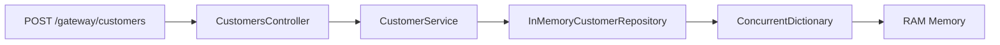

# Banking Microservices MVP

A .NET microservices banking demo with in-memory storage, custom service discovery, centralized configuration, an Ocelot API gateway, Polly resilience, and Serilog logging.

**Built with SOLID principles using Controller-Service-Repository pattern for maintainable, testable, and extensible code.**

## Documentation

| Guide | Link |
|-------|------|
| **Run & test** (WSL, Windows, Postman) | [docs/steps_run.md](docs/steps_run.md) |
| **Docker** (Compose, one command) | [docs/docker.md](docs/docker.md) |
| **API reference** (all endpoints) | [docs/api.md](docs/api.md) |
| **Docs index** | [docs/README.md](docs/README.md) |

## Quick start

**Prerequisites:** [.NET SDK](https://dotnet.microsoft.com/download) 10.0+ · optional [Docker](https://www.docker.com/products/docker-desktop/)

```bash
cd BankingMicroservices
dotnet restore BankingMicroservices.slnx
dotnet build BankingMicroservices.slnx
```

### **Option 1: Single-Command Startup (Easiest)**

**Linux/macOS/WSL:**
```bash
# One-time setup: Fix line endings and make executable
sed -i 's/\r$//' run_all.sh stop_all.sh setup_scripts.sh
chmod +x run_all.sh stop_all.sh setup_scripts.sh

# Start all services
./run_all.sh

# Stop all services (when done)  
./stop_all.sh
```

**Important:** Use `./run_all.sh`, NOT `source run_all.sh`

**Windows:**
```batch
# Start all services
run_all.bat

# Stop: Close all terminal windows or use Ctrl+C
```

### **Option 2: Manual Service Startup (5 Terminals)**

Open **5 separate terminals** and start services **in this exact order**:

#### **Terminal 1: Service Discovery (Port 5003) - START FIRST**
```bash
cd BankingMicroservices
dotnet run --project src/ServiceDiscovery/ServiceDiscovery.csproj
```
**Wait for:** `"Now listening on: http://localhost:5003"`  
**Verify:** Open http://localhost:5003 - Should show service dashboard

#### **Terminal 2: Configuration Service (Port 5004)**
```bash
cd BankingMicroservices  
dotnet run --project src/ConfigurationService/ConfigurationService.csproj
```
**Wait for:** `"Now listening on: http://localhost:5004"`  
**Verify:** Dashboard should now show 2 services

#### **Terminal 3: Customer Management Service (Port 5001)**
```bash
cd BankingMicroservices
dotnet run --project src/CustomerManagementService/CustomerManagementService.csproj
```
**Wait for:** `"Now listening on: http://localhost:5001"`  
**Verify:** http://localhost:5001/swagger should load

#### **Terminal 4: Account Management Service (Port 5002)**
```bash
cd BankingMicroservices
dotnet run --project src/AccountManagementService/AccountManagementService.csproj
```
**Wait for:** `"Now listening on: http://localhost:5002"`  
**Verify:** http://localhost:5002/swagger should load

#### **Terminal 5: API Gateway (Port 5010) - START LAST**
```bash
cd BankingMicroservices
dotnet run --project src/ApiGateway/ApiGateway.csproj
```
**Wait for:** `"Now listening on: http://localhost:5010"`  
**Final Verify:** All 5 services should appear in Service Discovery dashboard

### **Startup Verification Checklist**

✅ **Service Discovery Dashboard**: http://localhost:5003 shows all 5 services  
✅ **Service Discovery Dashboard**: http://localhost:5003 shows all 5 services  
✅ **All Health Checks**: All services respond `200 OK` to `/health` endpoint  
✅ **API Gateway Test**: `curl http://localhost:5010/gateway/customers`  
✅ **All Swagger UIs**: Each service's `/swagger` endpoint loads

**Important Notes:**
- **Dependency Order**: Service Discovery must start first, API Gateway must start last
- **Startup Time**: Allow 30-60 seconds for all services to register
- **Port Requirements**: Ensure ports 5001-5004 and 5010 are available

### **Automated Startup Scripts**

For convenience, the project includes platform-specific scripts:

#### **Linux/macOS/WSL:**
- `run_all.sh` - Starts all services with proper dependency ordering, health checks, and real-time monitoring
- `stop_all.sh` - Gracefully stops all services and cleans up PID files  
- `setup_scripts.sh` - Makes shell scripts executable (run once)

#### **Windows:**
- `run_all.bat` - Starts all services in separate CMD windows
- `start-services.ps1` - PowerShell version that starts services in separate windows

#### **Script Features:**
- ✅ **Dependency Management**: Starts services in correct order with delays
- ✅ **Health Checks**: Waits for each service to be healthy before starting next
- ✅ **Error Handling**: Stops on first failure with clear error messages
- ✅ **Process Management**: Tracks PIDs for clean shutdown
- ✅ **Real-time Monitoring**: Shows live service status updates
- ✅ **Browser Integration**: Opens Service Discovery dashboard automatically
- ✅ **Organized Logging**: Each service gets its own log folder (`logs/service-name/`)

#### **Script Usage Examples:**

```bash
# Linux/macOS - Full automated startup with monitoring
./run_all.sh

# Stop all services gracefully  
./stop_all.sh

# Check service status
./run_all.sh --status

# Windows - Start in separate windows
run_all.bat
```

### **Troubleshooting Script Issues**

#### **"command not found" Error (Linux/WSL)**
```bash
# Problem: Windows line endings in scripts
# Solution: Convert line endings
sed -i 's/\r$//' run_all.sh stop_all.sh setup_scripts.sh
chmod +x *.sh

# Then run with ./run_all.sh (NOT source run_all.sh)
```

#### **Permission Denied (Linux/macOS)**
```bash
# Make scripts executable
chmod +x run_all.sh stop_all.sh setup_scripts.sh
```

#### **Port Already in Use**
```bash
# Check what's using the ports
netstat -tulpn | grep :500

# Kill processes on specific port (Linux)
sudo fuser -k 5001/tcp

# Kill processes on specific port (Windows)
netstat -ano | findstr :5001
taskkill /PID <process_id> /F
```

#### **Framework Version Issues**
```bash
# Check .NET version
dotnet --version

# If you see "Framework not found" errors:
# 1. Ensure you have .NET 10.0+ SDK installed
# 2. Restore packages after framework update
dotnet restore BankingMicroservices.slnx
dotnet build BankingMicroservices.slnx
```

### **Option 3: Docker Compose (Recommended for Production-like Testing)**

Run all services with a single command:

```bash
# Build and start all services
docker-compose up --build

# Start in background (detached mode)
docker-compose up -d --build

# View logs from all services
docker-compose logs -f

# Stop all services
docker-compose down

# Stop and remove volumes
docker-compose down -v
```

**Docker Benefits:**
- ✅ **Isolated environments** - Each service runs in its own container
- ✅ **Automatic service discovery** - Services communicate via Docker network
- ✅ **Health checks** - Automatic restart of failed services
- ✅ **Proper startup ordering** - Dependencies managed via `depends_on`
- ✅ **Production-like setup** - Same environment as deployment


## Swagger API Documentation

### **Interactive API Documentation URLs**

Once services are running, access Swagger UI for interactive testing:

| Service | URL | Features |
|---------|-----|----------|
| **Customer Management** | http://localhost:5001/swagger | Create, read, update, delete customers |
| **Account Management** | http://localhost:5002/swagger | Create accounts, deposits, withdrawals, balance checks |
| **Service Discovery** | http://localhost:5003/swagger | Service registration, service lookup |
| **Configuration Service** | http://localhost:5004/swagger | Get configuration for each service |

## Service Discovery Dashboard

Monitor registered microservices in real-time:

| Dashboard Feature | URL (Local) | URL (Docker) | Description |
|------------------|-------------|--------------|-------------|
| **Visual Dashboard** | http://localhost:5003/ | http://localhost:5003/ | Live dashboard showing all registered services |
| **Registry API** | http://localhost:5003/api/registry | http://localhost:5003/api/registry | JSON view of all services with status |
| **Stats API** | http://localhost:5003/api/stats | http://localhost:5003/api/stats | Service registry statistics and counts |
| **Health Check** | http://localhost:5003/health | http://localhost:5003/health | Service discovery health status |

**Dashboard Features:**
- ✅ **Real-time monitoring** - Auto-refreshes every 30 seconds
- 📊 **Service statistics** - Total, healthy, and stale service counts  
- 🔗 **Clickable service URLs** - Direct links to registered services
- ⏱️ **Heartbeat tracking** - Shows last heartbeat timestamps
- 🚦 **Status indicators** - Visual healthy/stale service status

## Docker Compose Usage

### **Quick Start Commands:**

```bash
# Start all services (builds images if needed)
docker-compose up --build

# Start in background
docker-compose up -d --build

# View logs of specific service
docker-compose logs -f customer-service

# View logs of all services
docker-compose logs -f

# Scale a service (run multiple instances)
docker-compose up --scale customer-service=2

# Stop all services
docker-compose down

# Rebuild specific service
docker-compose build customer-service && docker-compose up customer-service
```

### **Docker Service URLs:**

All services are accessible via the same ports as local development:

| Service | Docker URL | Purpose |
|---------|------------|---------|
| **API Gateway** | http://localhost:5010 | Main entry point for all requests |
| **Customer Service** | http://localhost:5001/swagger | Customer management APIs |
| **Account Service** | http://localhost:5002/swagger | Account management APIs |
| **Service Discovery** | http://localhost:5003/ | Service registry dashboard |
| **Configuration Service** | http://localhost:5004/swagger | Centralized configuration |

## Health Check Endpoints

Monitor individual service health status:

| Service | Health Check URL | Response |
|---------|------------------|----------|
| **Service Discovery** | http://localhost:5003/health | `{"status":"UP","service":"service-discovery"}` |
| **Configuration Service** | http://localhost:5004/health | `{"status":"UP","service":"configuration-service"}` |
| **Customer Management** | http://localhost:5001/health | `{"status":"UP","service":"customer-management"}` |
| **Account Management** | http://localhost:5002/health | `{"status":"UP","service":"account-management"}` |
| **API Gateway** | http://localhost:5010/health | `{"status":"UP","service":"api-gateway"}` |

### **Health Check Testing:**
```bash
# Test all health endpoints quickly
curl -s http://localhost:5003/health | jq .
curl -s http://localhost:5004/health | jq .
curl -s http://localhost:5001/health | jq .
curl -s http://localhost:5002/health | jq .
curl -s http://localhost:5010/health | jq .
```

### **Docker Health Monitoring:**

```bash
# Check status of all services
docker-compose ps

# Check health of specific service
docker-compose ps service-discovery

# View resource usage
docker stats

# Execute commands inside container
docker-compose exec customer-service bash
```

### **Using Swagger for Testing**

1. **Start services** (locally or via Docker)
2. **Open Swagger UI** in your browser using URLs above
3. **Click "Try it out"** on any endpoint
4. **Fill parameters** and click "Execute"
5. **See real responses** from your services

### **Example Testing Workflow**

**Step 1: Create Customer** (Customer Service Swagger)
```json
POST /api/customers
{
  "name": "John Doe",
  "email": "john@example.com", 
  "phone": "555-1234",
  "address": "123 Main St"
}
```

**Step 2: Create Account** (Account Service Swagger)  
```json
POST /api/accounts
{
  "customerId": "<use-customer-id-from-step-1>"
}
```

**Step 3: Make Deposit** (Account Service Swagger)
```json
POST /api/accounts/deposit  
{
  "customerId": "<customer-id>",
  "amount": 1000.00
}
```

### **Swagger Features**

✅ **All endpoints** with HTTP methods and descriptions  
✅ **Request/response schemas** with example values  
✅ **Live API testing** with real service calls  
✅ **Parameter validation** and error responses  
✅ **Model documentation** for all DTOs  

**Note:** Swagger UI is only available in **development environment** for security.

## Services & ports

| Service | Port | Role |
|---------|------|------|
| API Gateway | 5010 | Public entry — `/gateway/customers`, `/gateway/accounts` |
| Customer Management | 5001 | Customer CRUD |
| Account Management | 5002 | Deposits, withdrawals, balances |
| Service Discovery | 5003 | Registry (Eureka-like, API only) |
| Configuration | 5004 | Central config per service |

## Architecture

```
                    +------------------+
                    |   API Gateway    |
                    |  (Ocelot) :5010  |
                    +--------+---------+
                             |
              +--------------+---------------+
              |                              |
    +---------v---------+          +---------v---------+
    | Customer Service  |          | Account Service   |
    |      :5001        |<-------->|      :5002        |
    +---------+---------+          +---------+---------+
              |                              |
              +--------------+---------------+
                             |
              +--------------v---------------+
              |     Service Discovery :5003  |
              +--------------+---------------+
                             |
              +--------------v---------------+
              |   Configuration Service :5004|
              +------------------------------+
```

Inter-service calls use **Service Discovery** (no hardcoded peer URLs in business logic).

## Solution structure

```
BankingMicroservices/
├── BankingMicroservices.sln
├── README.md
├── docker-compose.yml
├── Directory.Build.props
├── docs/
│   ├── README.md          # Documentation index
│   ├── steps_run.md       # How to run & test (local)
│   ├── docker.md          # Docker Compose guide
│   └── api.md             # API reference
├── docker/
│   ├── Dockerfile.api-gateway
│   ├── Dockerfile.account
│   ├── Dockerfile.configuration
│   ├── Dockerfile.customer
│   └── Dockerfile.service-discovery
└── src/
    ├── Shared/                    # DTOs, middleware, Polly, discovery client
    ├── ApiGateway/                # Ocelot API gateway
    ├── ServiceDiscovery/          # Custom registry
    │   ├── Controllers/           # ServiceDiscoveryController
    │   └── Services/              # IServiceRegistry, ServiceRegistry
    ├── ConfigurationService/      # Central config API  
    │   ├── Controllers/           # ConfigurationController
    │   └── Services/              # IConfigurationStore, ConfigurationStore
    ├── CustomerManagementService/ # Customer CRUD operations
    │   ├── Controllers/           # CustomersController
    │   ├── Services/              # ICustomerService, CustomerService
    │   ├── Repositories/          # ICustomerRepository, InMemoryCustomerRepository
    │   ├── Clients/               # AccountServiceClient (inter-service calls)
    │   └── Models/                # Customer domain model
    └── AccountManagementService/  # Account operations (deposits, withdrawals)
        ├── Controllers/           # AccountsController
        ├── Services/              # IAccountService, AccountService  
        ├── Repositories/          # IAccountRepository, InMemoryAccountRepository
        ├── Clients/               # CustomerServiceClient (inter-service calls)
        └── Models/                # Account domain model
```

## Features

### Core Banking Features
- **Customer Management**: Create, read, update, delete customers
- **Account Management**: Open accounts, deposits, withdrawals, balance inquiries
- **In-memory storage**: `ConcurrentDictionary` for fast operations (no database required)

### Microservices Architecture
- **Service Discovery**: Custom registry with heartbeat and stale cleanup (Eureka-like)
- **API Gateway**: Ocelot API gateway for unified entry point
- **Centralized Configuration**: Per-service config loaded on startup
- **Inter-service Communication**: HTTP clients with service discovery integration

### Enterprise Patterns & Quality
- **SOLID Principles**: Single Responsibility, Open/Closed, Liskov Substitution, Interface Segregation, Dependency Inversion
- **Controller-Service-Repository Pattern**: Clear separation of concerns
- **Dependency Injection**: Interface-based design for testability
- **Resilience**: Polly retry + circuit breaker for fault tolerance
- **Observability**: Serilog structured logging, Swagger/OpenAPI documentation
- **Error Handling**: RFC 7807 ProblemDetails for consistent error responses

### Technical Features
- **Framework**: **net10.0** (requires .NET 10.0+ SDK)
- **Docker Support**: Full containerization with Docker Compose
- **Type Safety**: Strongly-typed DTOs and API contracts
- **Async/Await**: Non-blocking operations throughout

## Framework Requirements

**This project requires .NET 10.0 SDK or later.**

### **Initial Setup Commands:**
```bash
# Navigate to project directory
cd BankingMicroservices

# Restore NuGet packages for .NET 10.0
dotnet restore BankingMicroservices.slnx

# Build all projects
dotnet build BankingMicroservices.slnx

# Verify .NET version
dotnet --version  # Should show 10.0.x
```

### **Framework Migration Notes:**
- All projects updated from `net8.0` to `net10.0`
- Requires .NET 10.0 runtime in both development and production
- Docker images automatically include .NET 10.0 runtime

## Architecture & Design Patterns

### SOLID Principles Implementation

This project demonstrates all five SOLID principles:

#### **Single Responsibility Principle (SRP)**
- **Controllers**: Handle HTTP concerns, validation, and response formatting
- **Services**: Handle business logic and orchestration  
- **Repositories**: Handle data access and persistence
- **Clients**: Handle inter-service communication

#### **Open/Closed Principle (OCP)**
- Services can be extended through interfaces without modifying existing code
- New implementations can be swapped easily via dependency injection

#### **Liskov Substitution Principle (LSP)**
- All interface implementations are fully substitutable
- Contract adherence maintained across all services

#### **Interface Segregation Principle (ISP)**  
- Small, focused interfaces (`ICustomerService`, `IAccountService`, etc.)
- No forced dependencies on unused methods

#### **Dependency Inversion Principle (DIP)**
- All services depend on abstractions (interfaces) not concrete classes
- Dependency injection container manages object creation and lifecycle

### Controller-Service-Repository Pattern

```csharp
// Example: Customer workflow
[ApiController] CustomersController 
    ↓ (HTTP concerns)
ICustomerService CustomerService 
    ↓ (business logic)  
ICustomerRepository InMemoryCustomerRepository
    ↓ (data access)
ConcurrentDictionary<Guid, Customer>
```

### Data Flow Example



### Inter-Service Communication

Services communicate through **HTTP clients** with **service discovery**:

```csharp
// Dynamic service discovery (no hardcoded URLs)
var baseUrl = await _discoveryClient.DiscoverAsync("account-management");
var response = await _httpClient.PostAsync($"{baseUrl}/api/accounts", content);
```

**Client Classes:**
- `AccountServiceClient` - Customer Service → Account Service
- `CustomerServiceClient` - Account Service → Customer Service  
- `ServiceDiscoveryClient` - All Services → Service Discovery
- `ConfigurationServiceClient` - All Services → Configuration Service

### Benefits of This Architecture

1. **Testability**: All business logic can be unit tested with mocked dependencies
2. **Maintainability**: Clear separation of concerns makes code easier to understand and modify
3. **Extensibility**: New implementations can be added without changing existing code
4. **Consistency**: Uniform patterns across all microservices
5. **Observability**: Structured logging and Swagger documentation throughout
6. **Resilience**: Polly integration for fault tolerance

### Example Unit Test Structure

```csharp
public class CustomerServiceTests
{
    private readonly Mock<ICustomerRepository> _mockRepository;
    private readonly Mock<AccountServiceClient> _mockAccountClient; 
    private readonly ICustomerService _customerService;

    public CustomerServiceTests()
    {
        _mockRepository = new Mock<ICustomerRepository>();
        _mockAccountClient = new Mock<AccountServiceClient>();
        _customerService = new CustomerService(_mockRepository.Object, _mockAccountClient.Object);
    }
    
    [Fact]
    public async Task CreateAsync_ShouldCreateCustomerAndAccount()
    {
        // Arrange, Act, Assert...
    }
}
```

## API Compatibility

✅ **100% Backward Compatible**: All existing API contracts maintained exactly
- Same HTTP methods and routes (`/gateway/customers`, `/gateway/accounts`)
- Same request/response formats (JSON with `ApiResponse<T>` wrapper)
- Same error handling behavior (RFC 7807 ProblemDetails)
- Same business logic flow

The refactoring provides enterprise-grade code structure while maintaining full API compatibility.

See `.gitignore` for excluded build artifacts and secrets.
